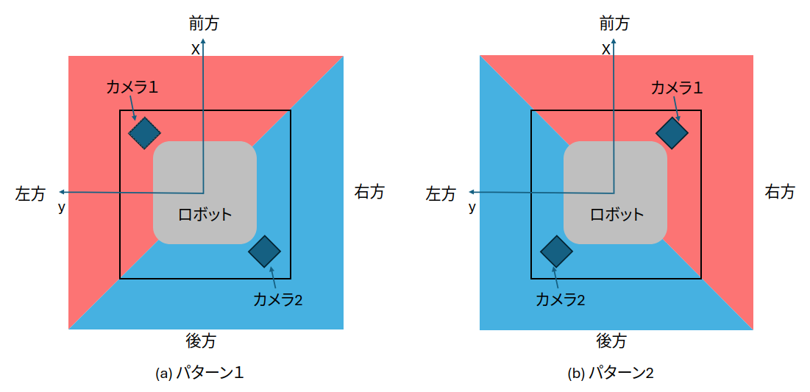

# CoRE_ControlScreen_sample

このリポジトリは、[The Championship of Robotics Engineers](https://core.scramble-robot.org/)（略称：CoRE「コア」）の遠隔操縦ロボット用の操作画面を作るシステムです。

180度の広い視野を持つ魚眼カメラの映像を合成して、まるで真上から見下ろしているような画像（アラウンドビュー）を作ります。これによって、ロボットの操作がしやすくなります。

また、透明な画像（PNG）を重ねて表示できるので、自分だけの照準や、チームのマークを簡単に追加することができます。

# 必要な部品

| 部品名 | 値段 | 数 | 合計 | 説明 | 買えるところ |
|-------|------|-----|------|------|------------|
| Raspberry Pi 4B/8GB | 13,970円 | 1台 | 13,970円 | 画像を合成する小型コンピュータ | [Link](https://raspberry-pi.ksyic.com/?pdp.id=552) |
| ELP-USBFHD04H-L180 | 6,799円 | 2台 | 13,598円 | 広い視野を持つ魚眼カメラ | [Link](https://amzn.asia/d/d2Er8BX) |
| ELP-USB8MP02G-L75-JP | 6,888円 | 1台 | 6,888円 | 普通の視野の正面用カメラ | [Link](https://amzn.asia/d/hFUPfFL) |
| マイクロHDMI-HDMIケーブル | 749円 | 1本 | 749円 | 映像を送るためのケーブル | [Link](https://amzn.asia/d/7HqSHYs) |
合計：35,205円

ロボットに組み込むときは、別に電源（USBに対応したモバイルバッテリーなど）が必要です。
バッテリーはいろいろな種類があるので、必要な動作時間やロボットの大きさに合わせて選びましょう。

セットアップや設定変更のために、HDMI対応のディスプレイやUSBマウス、キーボードも一時的に必要になります。

# 接続方法

全体の接続方法は以下の図のとおりです：

```
    +-------------------+
    | 魚眼カメラ 1      |
    | (ELP-USBFHD04H)   |----USB----+
    +-------------------+           |
                                    |
    +-------------------+           v
    | 魚眼カメラ 2      |         +-----------------+          +------------------+
    | (ELP-USBFHD04H)   |----USB-->  Raspberry Pi 4 |--HDMI--->  HDMI送信機       |
    +-------------------+         |     (8GB)       |          +------------------+
                                  +-----------------+ 
    +-------------------+           ^
    | 標準カメラ        |           |
    | (ELP-USB8MP02G)   |----USB----+
    +-------------------+
```

このシステムはUSBの差し込み位置によってカメラの役割を決めています。
Raspberry PiのUSBポートがある面に向かって、以下のように接続してください：

```
    +-------------------+ +-------------------+ +-------------------+ 
    | 標準カメラ        | | 魚眼カメラ 1      | |                   |
    | (ELP-USB8MP02G)   | | (ELP-USBFHD04H)   | |                   |
    +-------------------+ +-------------------+ |                   |
                                                |    LANポート      |
    +-------------------+ +-------------------+ |                   |
    |      接続なし     | | 魚眼カメラ 2      | |                   |
    |(USBキーボードなど)| | (ELP-USBFHD04H)   | |                   |
    +-------------------+ +-------------------+ +-------------------+ 
```

# カメラの配置方法
魚眼カメラはロボットの対角線上（向かい合う角）に設置し、真下を向けます。この配置で、カメラ1の映像（赤い部分）とカメラ2の映像（青い部分）を合わせることで、ロボットの中央部分（灰色の部分）に構造物があっても、周りを全方向見渡せる映像を作ることができます。



図に示すように、ロボットの中心を原点（0, 0）として、前方をx方向、左方向をy方向としたとき、各カメラの位置（x座標、y座標）を実際に測って記録しておきましょう。
また、地面からカメラレンズまでの高さとカメラの向き（姿勢）も必要です。

## カメラの姿勢について
カメラの姿勢とは、カメラが真下を向いているときに「カメラ画像の上方向」がロボットのどの方向を向いているかということです。わかりやすく説明すると：

カメラには「上下」の向きがあります。この「上」の方向は、撮影した画像の上端に対応します。カメラを真下に向けて取り付けたとき、この「上」方向がロボットの前方（x軸）と比べて何度回転しているかを「カメラの姿勢」と呼びます。

例えば：
- カメラの姿勢が0度：カメラの上方向がロボットの前方を指している
- カメラの姿勢が90度：カメラの上方向がロボットの左方向を指している
- カメラの姿勢が180度：カメラの上方向がロボットの後方を指している

この角度情報は、2つのカメラ映像を正しく合成するために必要です。

## カメラ配置のポイント

1. **対角に配置**: 魚眼カメラをロボットの対角線上に配置すると、見えない部分（死角）を最小にできます。

2. **高さを確保**: カメラはなるべく高い位置（ロボットの大きさによりますが、少なくとも40cm以上）に設置してください。低すぎると次の問題が起きます：
   - 映像内の物体がはっきり見えない
   - 映像のゆがみが大きくなる
   - 見えない部分が増える

3. **角度調整**: カメラは完全に真下（90度）に向けて固定します。

4. **しっかり固定**: カメラはロボットの振動で向きが変わらないように、しっかりと取り付けてください。

# Raspberry Pi のセットアップ方法
## 1. SDカードの準備

1. Raspberry Pi ImagerというソフトでRaspberry Pi OS Lite (64-bit,**bullseye**)をMicro SDカードに書き込みます。Imagerの設定でユーザ名を**pi**にして、パスワードも設定しておきましょう。
2. Micro SDカードの中に見える"bootfs"ドライブの直下に、`ssh`という名前の空のファイルを作ります（SSHを有効にするため）。
3. 準備したSDカードをRaspberry Piに挿入して、電源を入れます。

## 2. ROS2のインストール

Raspbian OS用の[非公式のインストールパッケージ](https://github.com/Ar-Ray-code/rpi-bullseye-ros2)を使います。

```bash
wget https://github.com/Ar-Ray-code/rpi-bullseye-ros2/releases/download/ros2-0.3.1/ros-humble-desktop-0.3.1_20221218_arm64.deb
sudo apt install ./ros-humble-desktop-0.3.1_20221218_arm64.deb
sudo pip install vcstool colcon-common-extensions

echo "source /opt/ros/humble/setup.bash" >> ~/.bashrc
source ~/.bashrc
```

### 2.1. ROS2パッケージのビルド

必要なソフトをインストールします：

```bash
sudo apt install libboost-python-dev libopencv-dev python3-opencv
pip3 install numba numpy==1.26.4
```

ソフトウェアをダウンロードします：

```bash
cd ~
git clone  --recursive https://github.com/TKG-Tou-Kai-Group/CoRE_ControlScreen_sample.git
```

USBカメラの設定をします：

```bash
sudo cp ~/CoRE_ControlScreen_sample/config/99-usb-camera.rules  /etc/udev/rules.d/
sudo udevadm control --reload-rules
sudo udevadm trigger --action=add
```

ROS2パッケージをビルドします：

```bash
cd ~/CoRE_ControlScreen_sample/ros2_ws
colcon build --symlink-install
source install/local_setup.bash
echo "source ~/ros2_ws/install/setup.bash" >> ~/.bashrc
```

### 2.2. プログラムの実行
```bash
ros2 launch core_robot_launcher robot_launcher.launch.py
```
- 画面にカメラ映像が表示されれば成功です！
- もし以下のようなエラーが出たら、Raspberry PiのOSのバージョンが間違っています。SDカードを作り直してください。OSのバージョンは必ず「bullseye」を選んでください（何も選ばないと最新版の「bookworm」がインストールされてしまいます）。
```
[INFO] [launch]: All log files can be found below /home/pi/.ros/log/2024-02-11-18-34-23-302048-raspberrypi-2602
[INFO] [launch]: Default logging verbosity is set to INFO
[ERROR] [launch]: Caught exception in launch (see debug for traceback): Caught exception when trying to load file of format [py]: No module named 'rclpy._rclpy_pybind11'
The C extension '/opt/ros/humble/lib/python3.9/site-packages/_rclpy_pybind11.cpython-311-aarch64-linux-gnu.so' isn't present on the system. Please refer to 'https://docs.ros.org/en/humble/Guides/Installation-Troubleshooting.html#import-failing-without-library-present-on-the-system' for possible solutions
```

### 2.3. 自動起動の設定
次のコマンドを実行すると、Raspberry Piの電源を入れたときに自動的にプログラムが起動するようになります：
```bash
sudo ln -s /home/pi/CoRE_ControlScreen_sample/service/scramble_robot_ros2.service /etc/systemd/system
chmod 755 /home/pi/CoRE_ControlScreen_sample/service/ros2_launch.sh
sudo systemctl enable scramble_robot_ros2.service
sudo systemctl start scramble_robot_ros2.service
systemctl status scramble_robot_ros2.service
```

### 2.4. ロボットに合わせた調整
自分のロボットのカメラ配置に合わせて、以下のファイルを編集する必要があります：
`/home/pi/CoRE_ControlScreen_sample/ros2_ws/src/core_robot_launcher/launch/robot_launcher.launch.py`

このファイルの35〜42行目にあるカメラのパラメータを、実際の測定値に変更してください：
- camera_height1: カメラ1の高さ（地面からの距離）
- camera_height2: カメラ2の高さ
- camera_x1: カメラ1のx座標（前後方向の位置）
- camera_x2: カメラ2のx座標
- camera_y1: カメラ1のy座標（左右方向の位置）
- camera_y2: カメラ2のy座標
- camera_angle1: カメラ1の姿勢[度]（0〜360度）
- camera_angle2: カメラ2の姿勢[度]

## 3. （オプション）SDカードの保護設定
SDカードへの書き込み中に電源が切れると、SDカードが壊れる可能性があります。これを防ぐために、「読み取り専用（read-only）」モードに設定できます。

ただし、この設定をするとソフトウェアの変更ができなくなるので、大会直前など、もうプログラムを変更しないときに設定するといいでしょう。

設定方法：
1. ターミナルで`sudo raspi-config`を実行
2. "4 Performance Options Configure performance settings"を選択
3. "P3 Overlay File System Enable/disable read-only file system"を選択
4. 有効化して再起動

## 4. その他の情報
- 設定ファイル（ros2_launch.sh）では`ROS_DOMAIN_ID=0`に設定しています。
- 初期設定では、IPアドレスはDHCPによって自動的に割り当てられます。

# 使用しているソフトウェアのライセンス
このシステムでは、以下の外部ソフトウェアが使われています（このリポジトリには直接含まれていません）：

- Raspbian OS
- ROS2 Humble
- [rpi-bullseye-ros2](https://github.com/Ar-Ray-code/rpi-bullseye-ros2/blob/main/LICENSE)（MITライセンス） CoRE_ControlScreen_sample

本リポジトリは、[The The Championship of Robotics Engineers](https://core.scramble-robot.org/)（通称CoRE(コア)）の遠隔操縦ロボットに向けた操作画面を生成するシステムをまとめたものです。
180度視野の魚眼カメラ映像を合成して真上から俯瞰して見ているようなアラウンドビュー画像を生成、表示することで操作性の向上を図っています。
また、透過PNG画像を合成できるため、照準の自作やチームのエンブレムの追加が容易にできるようにしています。
